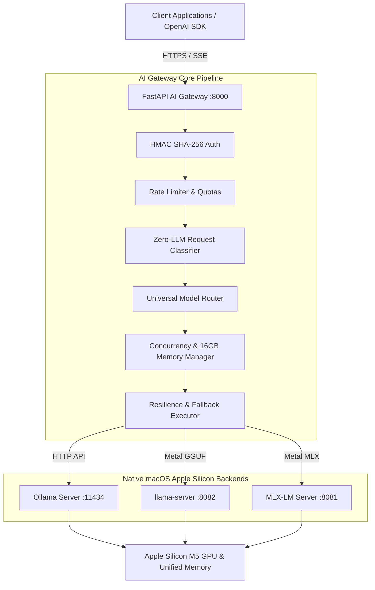

# Universal AI Model Gateway Architecture (Apple Silicon M5)

The AI Model Gateway is a high-performance, private, OpenAI-compatible AI gateway designed specifically for **Apple Silicon M5 hardware (16 GB Unified Memory)**. It completely decouples external client applications from internal inference backends, unifying multiple local models behind a single OpenAI-compatible API endpoint with API key authentication, rate limiting, zero-LLM smart request classification, and fallback resilience.

---

## High-Level Topology

---

## Core Components

### 1. Universal Smart Router (`model: "universal"`)
- **Zero-LLM Request Classifier**: Analyzes prompt content, code blocks, syntax keywords (`def`, `class`, `import`), math/logic markers, tool schemas, and image payloads in microseconds without triggering an LLM call.
- **Alias Resolution**: Maps aliases (`universal`, `fast`, `coding`, `reasoning`, `vision`, `embedding`) to active model definitions.

### 2. Memory-Aware Concurrency Queue
- Shared memory on Apple M5 (16 GB) requires strict concurrency limits to prevent memory swap thrashing.
- `ConcurrencyManager` enforces global semaphores and backend-specific semaphores (`OLLAMA_CONCURRENCY=2`, `LLAMACPP_CONCURRENCY=1`, `MLX_CONCURRENCY=2`).

### 3. Resilience & Fallback Executor
- Automatically detects retriable errors (`httpx.ConnectError`, `httpx.TimeoutException`, HTTP 502/503/504/429).
- Performs exponential backoff with random jitter.
- Seamlessly fails over to secondary healthy provider backends if the primary model server is unavailable.

### 4. Non-Buffering SSE Streaming
- Standard SSE pipeline (`text/event-stream`).
- Chunks pass through without buffering while token counts are metered in real-time.
