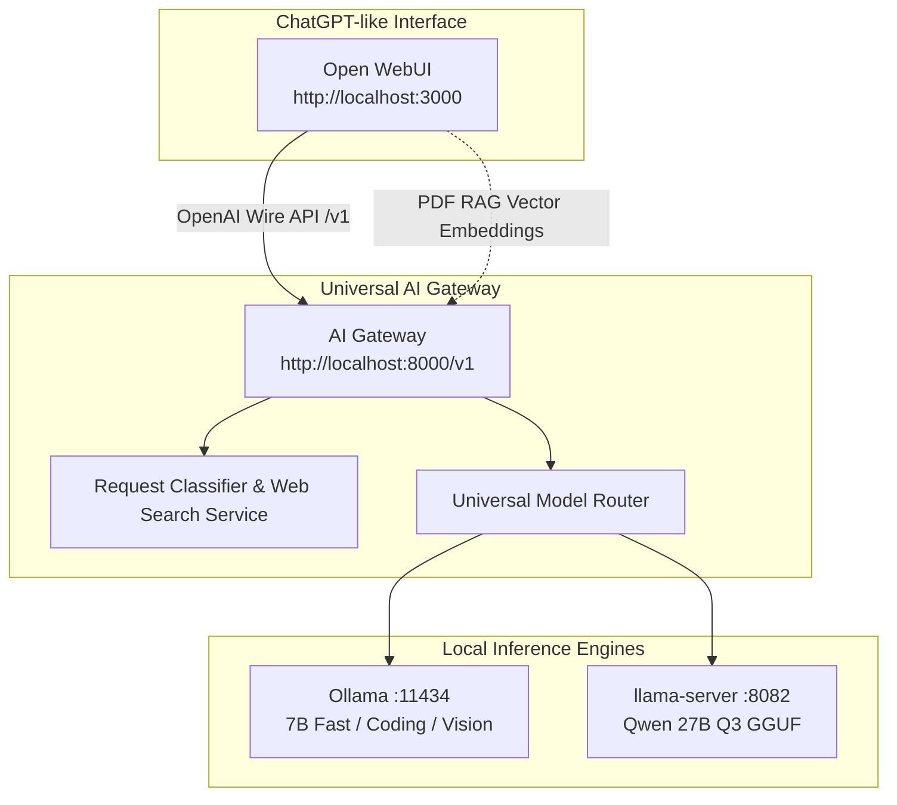

# Open WebUI Setup & Integration Guide (ChatGPT-like Interface)

This guide explains how to deploy **Open WebUI** as a decoupled ChatGPT-like frontend connected to your **Universal AI Gateway** on Apple Silicon M5.

---

## Ecosystem Architecture



---

## 1-Click Launch via Docker Compose

Launch Open WebUI pre-configured to connect to your AI Gateway:

```bash
make run-open-webui
```

Or run Docker Compose directly:
```bash
docker compose -f infrastructure/docker-compose.open-webui.yml up -d
```

Access Open WebUI in your browser at:
👉 **`http://localhost:3000`**

---

## Connecting Open WebUI to AI Gateway Manually

If running Open WebUI natively or on another machine:

1. Open **Open WebUI Settings** -> **Admin Settings** -> **Connections**.
2. Set **OpenAI API Base URL**: `http://127.0.0.1:8000/v1` (or `http://host.docker.internal:8000/v1` inside Docker).
3. Set **API Key**: `sk-local-testkey123456` (your Gateway API key).
4. Save connection settings.
5. In model dropdown select **`universal`**.

---

## Setting up PDF RAG (Document Search)

Open WebUI has a built-in RAG engine for uploading PDF documents and text files:

1. In Open WebUI, go to **Admin Settings** -> **Documents** / **RAG**.
2. Set **Embedding Engine**: `OpenAI`.
3. Set **OpenAI Base URL**: `http://host.docker.internal:8000/v1`.
4. Set **Embedding Model**: `embedding` (which routes to `nomic-embed-text` via Ollama).
5. Drag and drop any PDF into your chat window in Open WebUI to perform vector search questions!

---

## Enabling Web Search in Open WebUI

Open WebUI supports live Web Search:

1. Go to **Admin Settings** -> **Web Search**.
2. Enable **Web Search**.
3. Choose **DuckDuckGo** or **SearXNG** as search provider.
4. When asking questions requiring live information, toggle **Web Search** ON in the chat input bar.
